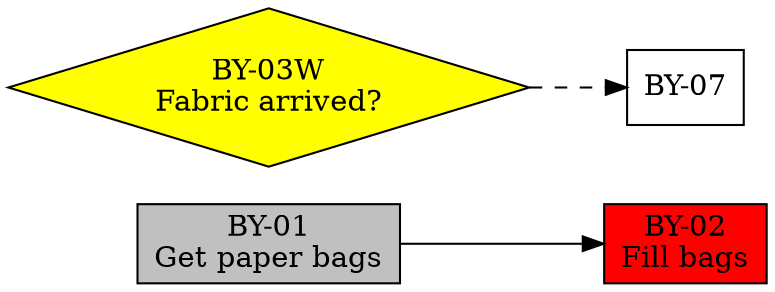

# tk Implementation Plan

This document describes the implementation phases for `tk`, a task tracker CLI. Each phase is designed to be independently implementable and testable.

**Reference:** See `tk-spec.md` for full requirements.

**Language:** Go (target Go 1.21+)

**Recommended Libraries:**
- CLI: `github.com/spf13/cobra` (mature, good completion support)
- YAML: `gopkg.in/yaml.v3` (preserves order, good error messages)
- Testing: standard library + `github.com/stretchr/testify` for assertions

---

## Progress

| Phase | Status | Notes |
|-------|--------|-------|
| 1. Core Types & Serialization | ✅ Complete | All types, ID handling, YAML serialization |
| 2. State Derivation | ✅ Complete | TaskState, WaitState, helper functions |
| 3. Dependency Graph | ✅ Complete | Graph queries, cycle detection |
| 4. Storage Layer | ✅ Complete | File I/O, config loading |
| 5. Core Mutations | 🔲 Not started | Next up |
| 6. CLI Infrastructure | 🔲 Not started | |
| 7. Read Commands | 🔲 Not started | |
| 8. Write Commands | 🔲 Not started | |
| 9. Shell Completion | 🔲 Not started | |

---

## Phase 1: Core Types & Serialization ✅ COMPLETE

### Goal
Define data structures and implement YAML serialization with correct formatting.

### Deliverables

**`internal/model/types.go`**
- `Project` struct with all fields from spec
- `Task` struct with all fields from spec
- `Wait` struct with all fields from spec
- `ResolutionCriteria` struct (with `Type`, `Question`, `After`, `CheckAfter`)
- `ProjectFile` struct combining Project metadata + Tasks slice + Waits slice

**`internal/model/id.go`**
- `ParseTaskID(s string) (prefix string, num int, err error)`
- `ParseWaitID(s string) (prefix string, num int, err error)`
- `ParseAnyID(s string) (prefix string, num int, isWait bool, err error)`
- `FormatTaskID(prefix string, num int, maxNum int) string` — handles zero-padding
- `FormatWaitID(prefix string, num int, maxNum int) string`
- `NormalizeID(s string) string` — uppercase, canonical padding

**`internal/model/serialize.go`**
- `LoadProject(path string) (*ProjectFile, error)`
- `SaveProject(path string, p *ProjectFile) error` — must maintain sort order
- Custom YAML marshaling to ensure:
  - Tasks sorted by numeric ID
  - Waits sorted by numeric ID
  - Null fields omitted (not written as `field: null`)
  - Multi-line strings use `|` block scalar style

### Test Cases

```
ID Parsing:
- "BY-07" → prefix="BY", num=7
- "by-7" → prefix="BY", num=7 (case insensitive, leading zeros optional)
- "BY-007" → prefix="BY", num=7
- "BY-03W" → prefix="BY", num=3, isWait=true
- "by-3w" → prefix="BY", num=3, isWait=true
- "INVALID" → error
- "BY-" → error
- "BY-W" → error
- "-07" → error

ID Formatting:
- FormatTaskID("BY", 7, 99) → "BY-07" (2 digits when max < 100)
- FormatTaskID("BY", 7, 100) → "BY-007" (3 digits when max >= 100)
- FormatTaskID("BY", 100, 100) → "BY-100"
- FormatWaitID("BY", 3, 99) → "BY-03W"

Serialization:
- Round-trip: load example from spec, save, load again, compare structs
- Sort order: save project with tasks [BY-10, BY-02, BY-01], verify file has [BY-01, BY-02, BY-10]
- Null handling: task with no tags saves without `tags:` line
- Multi-line: task.notes with newlines uses block scalar
```

### Implementation Notes (Phase 1 Complete)

**Files created:**
- `internal/model/types.go` — Core structs with YAML tags
- `internal/model/id.go` — ID parsing, formatting, utilities
- `internal/model/serialize.go` — YAML load/save with custom node building
- `internal/model/id_test.go` — 88.6% coverage
- `internal/model/serialize_test.go` — Round-trip, sort order, null omission tests

**Key types for Phase 2:**

```go
// Task.Status is one of: TaskStatusOpen, TaskStatusDone, TaskStatusDropped
// Task.BlockedBy is []string containing task IDs ("BY-05") or wait IDs ("BY-03W")

// Wait.Status is one of: WaitStatusOpen, WaitStatusDone, WaitStatusDropped
// Wait.BlockedBy is []string (waits can be blocked by tasks or other waits)
// Wait.ResolutionCriteria.Type is ResolutionTypeTime or ResolutionTypeManual
// Wait.ResolutionCriteria.After is *time.Time (for time waits)
// Wait.ResolutionCriteria.CheckAfter is *time.Time (for manual waits, optional)
```

**Useful ID utilities:**
- `IsWaitID(id string) bool` — returns true if ID ends with W
- `IsTaskID(id string) bool` — returns true if ID is a task (not a wait)
- `ExtractPrefix(id string) string` — "BY-07" → "BY"
- `ParseAnyID(s string) (prefix, num, isWait, err)` — parse any ID format

**Decisions made:**
- Zero-padding uses `maxNum` parameter (caller decides, typically `project.NextID - 1`)
- YAML comments are not preserved (too complex for v1)
- Times stored as RFC3339 format
- Due dates stored as date-only "2006-01-02" format
- Empty slices/nil pointers omitted from YAML output

### Open Questions (Resolved)

1. ~~**ID zero-padding threshold**~~ → Caller passes `maxNum`, typically `NextID - 1`
2. ~~**YAML style preferences**~~ → Comments not preserved, documented behavior

---

## Phase 2: State Derivation ✅ COMPLETE

### Goal
Implement pure functions that compute derived states from data.

### Deliverables

**`internal/model/state.go`**

```go
type TaskState string
const (
    TaskStateReady   TaskState = "ready"
    TaskStateBlocked TaskState = "blocked"
    TaskStateWaiting TaskState = "waiting"
    TaskStateDone    TaskState = "done"
    TaskStateDropped TaskState = "dropped"
)

type WaitState string
const (
    WaitStateDormant    WaitState = "dormant"
    WaitStateActionable WaitState = "actionable"
    WaitStatePending    WaitState = "pending"
    WaitStateDone       WaitState = "done"
    WaitStateDropped    WaitState = "dropped"
)

// ComputeTaskState returns the derived state for a task.
// blockerStates maps blocker IDs to their done/dropped status.
func ComputeTaskState(t *Task, blockerStates map[string]bool) TaskState

// ComputeWaitState returns the derived state for a wait.
// now is the current time for evaluating time-based conditions.
func ComputeWaitState(w *Wait, blockerStates map[string]bool, now time.Time) WaitState
```

### Test Cases

```
Task States:
- status=done → TaskStateDone (regardless of blockers)
- status=dropped → TaskStateDropped (regardless of blockers)
- status=open, no blocked_by → TaskStateReady
- status=open, blocked_by=[BY-01], BY-01 done → TaskStateReady
- status=open, blocked_by=[BY-01], BY-01 open → TaskStateBlocked
- status=open, blocked_by=[BY-01W], BY-01W open → TaskStateWaiting
- status=open, blocked_by=[BY-01, BY-02W], BY-01 open, BY-02W open → TaskStateBlocked (both blocked and waiting - spec says task can be both)
- status=open, blocked_by=[BY-01], BY-01 dropped → TaskStateReady (dropped blockers don't block)

Wait States:
- status=done → WaitStateDone
- status=dropped → WaitStateDropped
- status=open, blocked_by=[BY-01], BY-01 open → WaitStateDormant
- status=open, no blockers, type=manual, check_after=null → WaitStateActionable
- status=open, no blockers, type=manual, check_after in future → WaitStatePending
- status=open, no blockers, type=manual, check_after in past → WaitStateActionable
- status=open, no blockers, type=time, after in future → WaitStatePending
- status=open, no blockers, type=time, after in past → WaitStatePending (tk check transitions these)
```

### Open Questions (Resolved)

1. ~~**Blocked vs Waiting priority**~~ → For `ComputeTaskState`, "blocked" takes precedence when both conditions apply. Added separate helper functions `IsTaskBlocked()` and `IsTaskWaiting()` for filtering use cases where both states need to be checked independently.

### Implementation Notes (Phase 2 Complete)

**Files created:**
- `internal/model/state.go` — State types and computation functions
- `internal/model/state_test.go` — Comprehensive test coverage

**Key types:**
```go
type TaskState string  // "ready", "blocked", "waiting", "done", "dropped"
type WaitState string  // "dormant", "actionable", "pending", "done", "dropped"
type BlockerStatus map[string]bool  // ID → resolved (true = done/dropped)
```

**Functions implemented:**
- `ComputeTaskState(t *Task, blockerStates BlockerStatus) TaskState`
- `ComputeWaitState(w *Wait, blockerStates BlockerStatus, now time.Time) WaitState`
- `IsTaskBlocked(t *Task, blockerStates BlockerStatus) bool` — for --blocked filter
- `IsTaskWaiting(t *Task, blockerStates BlockerStatus) bool` — for --waiting filter
- `IsTaskReady(t *Task, blockerStates BlockerStatus) bool` — for --ready filter

**Design decisions:**
- `BlockerStatus` type alias for `map[string]bool` for clearer semantics
- Unknown blockers (not in map) treated as blocking (safe default)
- Time waits always return `pending` even if after time passed — `tk check` handles transitions
- Terminal states (done/dropped) checked first before evaluating blockers

**Test coverage:** 93.9%

### Phase 2 Review Notes

Review completed. Changes made:

1. **Fixed gofmt issue** in `types.go` — struct field comment alignment
2. **Removed dead code** in `digitWidth()` — unreachable `if width < 2` branch
3. **Added test coverage** for edge cases:
   - `digitWidth` fallback path for numbers >= 10000
   - `DisplayText` with nil After and unknown types

**All checks passing:**
- `go test ./...` — all tests pass
- `go test -race ./...` — no race conditions
- `go vet ./...` — no issues
- `gofmt -l .` — no formatting issues
- `go mod tidy` — dependencies clean

---

## Phase 3: Dependency Graph

### Goal
Build in-memory graph for dependency traversal and cycle detection.

### Deliverables

**`internal/graph/graph.go`**

```go
type Node struct {
    ID     string // e.g., "BY-07" or "BY-03W"
    IsWait bool
}

type Graph struct {
    // internal adjacency representation
}

// BuildGraph constructs a dependency graph from a project.
func BuildGraph(p *ProjectFile) *Graph

// BlockedBy returns the direct blockers of the given node.
func (g *Graph) BlockedBy(id string) []string

// Blocking returns nodes directly blocked by the given node.
func (g *Graph) Blocking(id string) []string

// TransitiveBlockedBy returns all transitive blockers.
func (g *Graph) TransitiveBlockedBy(id string) []string

// TransitiveBlocking returns all nodes transitively blocked by the given node.
func (g *Graph) TransitiveBlocking(id string) []string
```

**`internal/graph/cycle.go`**

```go
// CheckCycle determines if adding an edge from `from` to `to` would create a cycle.
// Returns nil if no cycle, or the cycle path if one would be created.
func (g *Graph) CheckCycle(from, to string) []string

// Example: adding BY-07 → BY-05 when BY-05 → BY-03 → BY-07 exists
// Returns: ["BY-05", "BY-03", "BY-07", "BY-05"]
```

### Test Cases

```
Graph Construction:
- Empty project → empty graph
- Tasks with no dependencies → nodes exist, no edges
- Task blocked by task → correct edge
- Task blocked by wait → correct edge
- Wait blocked by task → correct edge
- Wait blocked by wait → correct edge

Queries:
- BlockedBy returns only direct blockers
- Blocking returns only direct dependents
- TransitiveBlockedBy follows full chain
- TransitiveBlocking follows full chain
- Queries on non-existent ID return empty (not error)

Cycle Detection:
- A → B, adding B → A → detects cycle [A, B, A]
- A → B → C, adding C → A → detects cycle [A, B, C, A]
- A → B, C → D, adding D → C → detects cycle (separate subgraph)
- A → B, adding A → C → no cycle
- Self-reference A → A → detects cycle [A, A]
- Mixed: Task → Wait → Task cycle detected
```

### Implementation Notes (Phase 3 Complete)

**Files created:**
- `internal/graph/graph.go` — Graph struct with adjacency list representation
- `internal/graph/cycle.go` — Cycle detection using DFS
- `internal/graph/graph_test.go` — 17 tests for graph operations
- `internal/graph/cycle_test.go` — 14 tests for cycle detection

**Key types:**
```go
type Graph struct {
    blockedBy map[string][]string  // node → direct blockers
    blocking  map[string][]string  // node → nodes it blocks (reverse edges)
    nodes     map[string]bool      // all known nodes
}
```

**Functions implemented:**
- `BuildGraph(p *ProjectFile) *Graph` — construct graph from project
- `BlockedBy(id string) []string` — direct blockers
- `Blocking(id string) []string` — nodes directly blocked by this node
- `TransitiveBlockedBy(id string) []string` — all transitive blockers (sorted)
- `TransitiveBlocking(id string) []string` — all transitively blocked nodes (sorted)
- `HasNode(id string) bool` — check if node exists
- `Nodes() []string` — all node IDs (sorted)
- `CheckCycle(from, to string) []string` — returns cycle path if adding edge would create cycle
- `WouldCreateCycle(from, to string) bool` — convenience boolean wrapper
- `AddEdge(from, to string) func()` — temporarily add edge, returns removal function

**Design decisions:**
- Map-based adjacency list for O(1) neighbor lookup
- DFS for cycle detection (check if `to` can reach `from` via blockedBy edges)
- Results sorted for deterministic output
- Queries on non-existent IDs return empty slices (not errors)
- BlockedBy/Blocking return copies to prevent mutation

**Test coverage:** 100%

**All checks passing:**
- `go test ./...` — all tests pass
- `go test -race ./...` — no race conditions
- `go vet ./...` — no issues
- `gofmt -l .` — no formatting issues
- `go mod tidy` — dependencies clean

### Phase 3 Review Notes

Review completed. Changes made:

1. **Added test coverage** for `removeString` edge case — calling the removal function twice (idempotent behavior)

Test coverage improved from 98.9% to 100%.

---

## Phase 4: Storage Layer ✅ COMPLETE

### Goal
File system operations for .tk/ directory and configuration.

### Deliverables

**`internal/storage/storage.go`**

```go
type Storage struct {
    root string // path to directory containing .tk/
}

// Open returns a Storage for the given directory.
// Returns error if .tk/ does not exist.
func Open(dir string) (*Storage, error)

// Init creates .tk/ directory with default project.
// Returns error if .tk/ already exists.
func Init(dir string, projectName string, prefix string) (*Storage, error)

// LoadProject loads a project by prefix (e.g., "BY").
func (s *Storage) LoadProject(prefix string) (*ProjectFile, error)

// LoadProjectByID loads a project by its ID (e.g., "backyard").
func (s *Storage) LoadProjectByID(id string) (*ProjectFile, error)

// SaveProject saves a project file.
func (s *Storage) SaveProject(p *ProjectFile) error

// ListProjects returns all project prefixes.
func (s *Storage) ListProjects() ([]string, error)

// DeleteProject removes a project file.
func (s *Storage) DeleteProject(prefix string) error

// ProjectExists checks if a prefix is in use.
func (s *Storage) ProjectExists(prefix string) bool
```

**`internal/storage/config.go`**

```go
type Config struct {
    AutoCheck       bool   `yaml:"autocheck"`
    DefaultProject  string `yaml:"default_project"`
    DefaultPriority int    `yaml:"default_priority"`
}

// LoadConfig loads .tkconfig.yaml if it exists, otherwise returns defaults.
func (s *Storage) LoadConfig() (*Config, error)

// Note: Config is never written by tk (user-managed file)
```

### Test Cases

```
Init:
- Init in empty dir → creates .tk/config.yaml, .tk/projects/XX.yaml
- Init with custom name/prefix → uses those values
- Init in dir with existing .tk/ → error
- Default project has: id="default", prefix="DF", name="Default", status=active

Load/Save:
- Load existing project by prefix → success
- Load non-existent prefix → clear error
- Save project → file at .tk/projects/{PREFIX}.yaml
- Save preserves all fields

ListProjects:
- Empty .tk/projects/ → empty list
- Multiple projects → all prefixes returned

Config:
- No .tkconfig.yaml → returns defaults (autocheck=false, default_project="default", default_priority=3)
- Partial .tkconfig.yaml → merges with defaults
- Invalid YAML → error with filename
```

### Implementation Notes

- Use `os.MkdirAll` for creating nested directories
- File paths: `.tk/config.yaml`, `.tk/projects/{PREFIX}.yaml`
- Prefix lookup is case-insensitive on load but files are always uppercase

### Open Questions (Resolved)

1. ~~**Default project prefix**~~ → Using "DF" as default prefix
2. ~~**Config validation**~~ → Config is loaded but not validated at load time; validation happens on use

### Implementation Notes (Phase 4 Complete)

**Files created:**
- `internal/storage/storage.go` — Storage struct and core operations
- `internal/storage/config.go` — Config struct and LoadConfig
- `internal/storage/storage_test.go` — 28 tests covering all operations
- `internal/storage/config_test.go` — 8 tests for config loading

**Key types:**
```go
type Storage struct {
    root string // path to directory containing .tk/
}

type StorageConfig struct {
    Version int `yaml:"version"` // stored in .tk/config.yaml
}

type Config struct {
    AutoCheck       bool   `yaml:"autocheck"`
    DefaultProject  string `yaml:"default_project"`
    DefaultPriority int    `yaml:"default_priority"`
}
```

**Functions implemented:**
- `Open(dir string) (*Storage, error)` — open existing .tk/ directory
- `Init(dir string, projectName, prefix string) (*Storage, error)` — create new .tk/ with default project
- `LoadProject(prefix string) (*ProjectFile, error)` — load by prefix (case-insensitive)
- `LoadProjectByID(id string) (*ProjectFile, error)` — load by project ID
- `SaveProject(p *ProjectFile) error` — save project file
- `ListProjects() ([]string, error)` — list all project prefixes
- `DeleteProject(prefix string) error` — delete project file
- `ProjectExists(prefix string) bool` — check if prefix exists
- `LoadConfig() (*Config, error)` — load user config or return defaults
- `Root()`, `TkPath()`, `ConfigPath()` — path accessors

**Design decisions:**
- `.tk/config.yaml` stores storage version (currently 1)
- `.tkconfig.yaml` is user configuration (sibling to .tk/, never auto-generated)
- Prefix lookup is case-insensitive (BY, by, By all work)
- Project files always use uppercase prefix (BY.yaml)
- Default project: id="default", prefix="DF", name="Default"
- Config defaults: autocheck=false, default_project="default", default_priority=3
- Partial config merges with defaults (only specified fields override)

**Test coverage:** 80.8%

**All checks passing:**
- `go test ./...` — all tests pass
- `go test -race ./...` — no race conditions
- `go vet ./...` — no issues
- `gofmt -l .` — no formatting issues
- `go mod tidy` — dependencies clean

---

## Phase 5: Core Mutations

### Goal
Implement all business logic for modifying data.

### Deliverables

**`internal/ops/project.go`**
- `CreateProject(s *Storage, id, prefix, name, description string) error`
- `EditProject(s *Storage, prefix string, changes ProjectChanges) error`
- `DeleteProject(s *Storage, prefix string, force bool) error`
- `ChangeProjectPrefix(s *Storage, oldPrefix, newPrefix string) error` — includes ID migration

**`internal/ops/task.go`**
- `AddTask(s *Storage, prefix string, title string, opts TaskOptions) (*Task, error)`
- `EditTask(s *Storage, taskID string, changes TaskChanges) error`
- `CompleteTask(s *Storage, taskID string, force bool) (*CompletionResult, error)`
- `DropTask(s *Storage, taskID string, reason string, dropDeps, removeDeps bool) error`
- `ReopenTask(s *Storage, taskID string) error`
- `DeferTask(s *Storage, taskID string, until time.Time) (*Wait, error)`
- `MoveTask(s *Storage, taskID string, toPrefix string) error`
- `AddBlocker(s *Storage, taskID, blockerID string) error`
- `RemoveBlocker(s *Storage, taskID, blockerID string) error`

**`internal/ops/wait.go`**
- `AddWait(s *Storage, prefix string, opts WaitOptions) (*Wait, error)`
- `EditWait(s *Storage, waitID string, changes WaitChanges) error`
- `ResolveWait(s *Storage, waitID string, resolution string) error`
- `DropWait(s *Storage, waitID string, reason string, dropDeps, removeDeps bool) error`
- `DeferWait(s *Storage, waitID string, until time.Time) error`

**`internal/ops/check.go`**
- `RunCheck(s *Storage) (*CheckResult, error)` — auto-resolve time waits

**`internal/ops/validate.go`**
- `Validate(s *Storage) ([]ValidationError, error)`
- `ValidateAndFix(s *Storage) ([]ValidationFix, error)`

**Supporting types:**
```go
type CompletionResult struct {
    Completed     []string // IDs of completed tasks (includes auto-completed)
    Unblocked     []string // task IDs now unblocked
    WaitsActivated []string // wait IDs now actionable/pending
}

type CheckResult struct {
    ResolvedWaits []string // time waits that were auto-resolved
    Unblocked     []string // items unblocked by those resolutions
    AutoCompleted []string // tasks auto-completed as a result
}
```

### Test Cases

```
AddTask:
- Add to active project → success, returns task with generated ID
- Add to paused project → error
- Add to done project → error
- Add with blocked-by referencing non-existent ID → error
- Add with blocked-by referencing ID in different project → error
- ID uses next_id, increments next_id

CompleteTask:
- Complete task with no blockers → success
- Complete task with done blockers → success
- Complete task with open blockers → error
- Complete with force=true → removes open blockers, then completes
- Completing triggers auto-complete cascade on dependents with auto_complete=true
- Completing activates dormant waits blocked only by this task
- Sets done_at timestamp

DropTask:
- Drop task with no dependents → success
- Drop task with dependents, no flags → error listing dependents
- Drop with dropDeps=true → drops all dependents recursively
- Drop with removeDeps=true → removes self from dependents' blocked_by
- Sets dropped_at, drop_reason

DeferTask:
- Defer task with no open waits → creates time wait, adds to blocked_by
- Defer task already blocked by open wait → error
- Created wait has correct after time

MoveTask:
- Move task with no references → success, new ID in target project
- Move task referenced by another task → error
- Move task that references task in old project → error

AddBlocker:
- Add valid blocker → success
- Add blocker that would create cycle → error with cycle path
- Add non-existent blocker → error
- Add blocker from different project → error

ResolveWait:
- Resolve actionable manual wait → success
- Resolve dormant wait → error
- Resolve time wait early → allowed, updates after to now
- Sets done_at, resolution field

RunCheck:
- Time wait with after in past → resolved, added to result
- Resolution cascades: unblocks dependents, triggers auto-complete
- Time wait with after in future → not resolved
- Manual waits not affected
```

### Implementation Notes

- All mutation functions should:
  1. Load relevant project(s)
  2. Validate preconditions
  3. Make changes
  4. Save project(s)
- Use graph cycle detection before adding blockers
- Auto-complete cascade: BFS/DFS through dependents, complete those with auto_complete=true and all blockers done

### Open Questions for Jack

1. **Batch completion error handling**: Spec says `tk done BY-07 BY-08 BY-09` is "best effort". If BY-07 succeeds but BY-08 fails, should we:
   - Roll back BY-07? (transactional)
   - Keep BY-07 done, report BY-08 error, continue to BY-09? (best effort)
   - Recommend: best effort, report all errors at end.

2. **Move task ID assignment**: When moving BY-07 to project HH, does it become HH-{next_id} or try to preserve the number 07? Recommend: use next_id for simplicity.

3. **Defer with existing time wait**: Spec says error if task "already has open waits". Does this mean:
   - Any wait in blocked_by that's open?
   - Only time waits?
   - Recommend: any open wait (simpler rule).

---

## Phase 6: CLI Infrastructure

### Goal
Command framework, output formatting, editor integration.

### Deliverables

**`cmd/tk/main.go`**
- Cobra root command setup
- Global flags (--help, --version)

**`internal/cli/prefix.go`**
- Command prefix matching (e.g., "li" → "list")

**`internal/cli/output.go`**
```go
// Table formats columnar output
type Table struct { ... }
func (t *Table) AddRow(cols ...string)
func (t *Table) Render(w io.Writer)

// Color support
func IsTerminal(w io.Writer) bool
func Green(s string) string
func Red(s string) string
func Yellow(s string) string
func Gray(s string) string
```

**`internal/cli/editor.go`**
```go
// EditInEditor opens content in $EDITOR and returns modified content.
// Returns error if EDITOR not set or editor exits non-zero.
func EditInEditor(content []byte, suffix string) ([]byte, error)
```

**`internal/cli/errors.go`**
```go
// FormatError returns a user-friendly error message.
func FormatError(err error) string

// Error types for specific formatting
type NotFoundError struct { ... }
type CycleError struct { ... }
type ValidationError struct { ... }
```

### Test Cases

```
Prefix Matching:
- "li" with commands [list, log] → "list" (unique)
- "l" with commands [list, log] → error (ambiguous)
- "list" with commands [list, log] → "list" (exact match)
- "xyz" with commands [list, log] → error (no match)

Output:
- Table aligns columns correctly
- Color functions return ANSI codes when terminal
- Color functions return plain text when not terminal

Editor:
- EDITOR not set → clear error message
- EDITOR exits 0 → returns modified content
- EDITOR exits non-zero → error
```

### Implementation Notes

- Use `golang.org/x/term` for terminal detection
- Editor suffix should be `.yaml` for syntax highlighting
- Consider `VISUAL` fallback before `EDITOR`

---

## Phase 7: Read Commands

### Goal
Implement all commands that only read data.

### Commands

| Command | Notes |
|---------|-------|
| `tk init` | Uses Phase 4 Init |
| `tk projects [--all]` | List active projects, --all includes paused/done |
| `tk project <id>` | Show summary: "5 open (2 ready, 3 blocked), 10 done, 2 waits" |
| `tk list [filters]` | See filter flags in spec |
| `tk show <id>` | Full task/wait details |
| `tk waits [filters]` | Auto-runs check if autocheck enabled |
| `tk find <query>` | Case-insensitive substring in title/question/notes |
| `tk ready` | Alias for `tk list --ready` |
| `tk waiting` | Alias for `tk waits --actionable` |
| `tk graph` | DOT output |
| `tk validate` | Report only |

### Output Formats

**`tk list` columns:** ID, status indicator, priority, title, tags (if any)
```
BY-01  [done]     P2  Get paper bags           [shopping]
BY-02  [blocked]  P2  Fill bags with weeds
BY-07  [waiting]  P2  Lay landscape fabric     [hardscape, weekend]
BY-08  [ready]    P1  Order more gravel
```

**`tk waits` columns:** ID, display text
```
BY-03W  Did the landscape fabric arrive from Home Depot?
BY-07W  Until 2026-01-15
```

**`tk show` format:**
```
BY-07: Lay landscape fabric
Status:    open (waiting)
Priority:  2 (high)
Tags:      hardscape, weekend
Assignee:  -
Due:       -
Auto-complete: no
Created:   2025-12-02T10:30:00
Updated:   2025-12-06T14:22:00

Blocked by:
  BY-05  [done]  Dig test hole
  BY-03W [open]  Did the landscape fabric arrive from Home Depot?

Notes:
  Use 4ft wide fabric, ~90 linear feet.
  Don't forget landscape staples.
```

**`tk graph` DOT format:**


### Test Cases

Integration tests with fixture .tk/ directories:
```
- tk list returns correct tasks
- tk list --ready excludes blocked/waiting
- tk list --blocked includes only blocked
- tk list --tag=x filters correctly
- tk list --tag=x --tag=y requires both tags (AND)
- tk list -p X restricts to project
- tk show BY-07 shows all fields
- tk show BY-99 → "task BY-99 not found"
- tk find "gravel" matches title substring
- tk find "gravel" matches notes substring
- tk graph produces valid DOT
```

---

## Phase 8: Write Commands

### Goal
Implement all commands that modify data.

### Commands

| Command | Notes |
|---------|-------|
| `tk add` | Uses default_project if -p not specified |
| `tk edit <id>` | Many flags, see spec |
| `tk tag <id> <tag>` | Shortcut for --add-tag |
| `tk untag <id> <tag>` | Shortcut for --remove-tag |
| `tk done <id>...` | Batch support, --force |
| `tk drop <id>` | --reason, --drop-deps, --remove-deps |
| `tk reopen <id>` | Works on done or dropped |
| `tk defer <id>` | --days or --until |
| `tk move <id>` | --to=project |
| `tk block <id>` | --by=blocker |
| `tk unblock <id>` | --from=blocker |
| `tk blocked-by <id>` | Query |
| `tk blocking <id>` | Query |
| `tk project new` | --prefix, --name required |
| `tk project edit` | Flags or -i |
| `tk project delete` | --force required |
| `tk dump <project>` | Plain text export |
| `tk wait add` | --question or --after |
| `tk wait edit` | Flags or -i |
| `tk wait resolve` | --as for resolution text |
| `tk wait drop` | Same flags as task drop |
| `tk wait defer` | --days or --until |
| `tk check` | Auto-resolve time waits |
| `tk validate --fix` | Auto-repair |

### Command Output Examples

**`tk add`:**
```
BY-08 Dig test hole
```

**`tk done BY-07`:**
```
BY-07 done.
Unblocked: BY-08, BY-09
Waits now active: BY-03W
Auto-completed: BY-10
```

**`tk done BY-07` (with blockers, no --force):**
```
error: BY-07 has incomplete blockers: BY-05, BY-03W
Use --force to remove blockers and complete anyway.
```

**`tk drop BY-07` (with dependents, no flags):**
```
error: BY-07 has dependents: BY-08, BY-09
Use --drop-deps to drop them too, or --remove-deps to unlink them.
```

### Test Cases

Integration tests verifying file changes:
```
- tk add creates task, increments next_id
- tk edit --title changes title, updates updated timestamp
- tk done marks complete, sets done_at
- tk done --force removes blockers first
- tk drop sets status, dropped_at, drop_reason
- tk drop --drop-deps cascades
- tk drop --remove-deps unlinks
- tk reopen clears done_at/dropped_at/drop_reason
- tk defer creates wait and links it
- tk project edit --prefix renames file and all task IDs
```

---

## Phase 9: Shell Completion

### Goal
Dynamic shell completion with task/wait/project ID suggestions.

### Deliverables

**`cmd/tk/completion.go`**
- `tk completion bash`
- `tk completion zsh`
- `tk completion fish`

### Completion Behavior

- Commands: complete from command list
- `--project`, `-p`: complete from project IDs
- Task ID arguments: complete from task IDs in active projects
- Wait ID arguments: complete from wait IDs in active projects
- `--tag`: complete from existing tags across projects
- `--blocked-by`, `--by`: complete from task and wait IDs

### Implementation Notes

- Cobra has built-in completion support via `ValidArgsFunction`
- Dynamic completion requires reading .tk/ at completion time
- Handle errors gracefully (return empty completions, don't crash)

---

## Testing Strategy

### Unit Tests
- Phases 1-3: Pure functions, no I/O, fast
- Target: >90% coverage on core logic

### Integration Tests
- Phases 4-8: Use temporary directories
- Create fixture .tk/ structures programmatically
- Verify file contents after operations

### End-to-End Tests
- Run actual `tk` binary
- Shell script or Go exec-based tests
- Cover happy paths and key error cases

### Test Fixtures

Create reusable test fixtures:
```
fixtures/
  empty/              # just .tk/config.yaml
  single-project/     # one project with varied tasks
  multi-project/      # multiple projects with cross-references (none allowed, but test errors)
  complex-graph/      # deep dependency chains for cycle/cascade testing
```

---

## Definition of Done

Each phase is complete when:

1. All deliverables implemented
2. All listed test cases passing
3. No compiler warnings
4. Code passes `go vet` and `staticcheck`
5. Public functions have doc comments
6. Open questions resolved or documented as TODOs with `// TODO(jack):` prefix

---

## Open Questions Summary

Collected questions requiring clarification from Jack:

### Phase 1
1. ID zero-padding: based on `next_id` or highest existing ID?
2. YAML comments: preserve or discard on save?

### Phase 4
3. Default project prefix for `tk init`?
4. Config validation: error on invalid default_project reference?

### Phase 5
5. Batch completion: transactional or best-effort?
6. Move task: preserve number or use next_id?
7. Defer validation: any open wait or only time waits?

### General
8. Any preference on error message style/verbosity?
9. Should `tk` with no args show help or a dashboard?

---

## Suggested Implementation Order

```
Week 1: Foundation
├── Phase 1: Types & Serialization
├── Phase 2: State Derivation
└── Phase 6: CLI Infrastructure (parallel)

Week 2: Core Logic
├── Phase 3: Dependency Graph
├── Phase 4: Storage Layer
└── Phase 5: Core Mutations (start)

Week 3: Operations
├── Phase 5: Core Mutations (complete)
└── Phase 7: Read Commands

Week 4: Commands & Polish
├── Phase 8: Write Commands
└── Phase 9: Shell Completion
```

Note: Timeline is indicative structure only, not a commitment. Adjust based on actual progress and complexity encountered.
